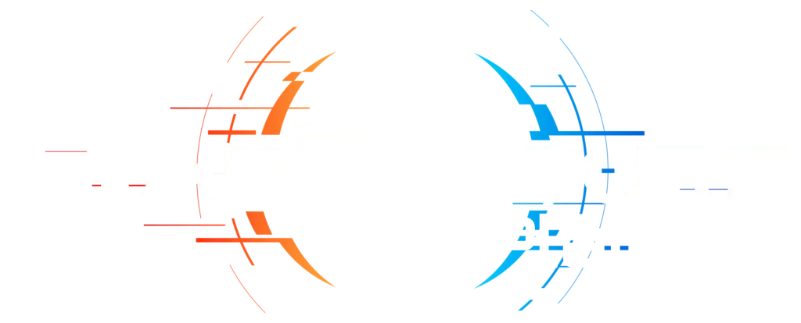

# 🚀 Starrupture Planner

<div align="center">
  

**Calcula. Construye. Domina.** La herramienta definitiva para organizar tus cadenas de producción en **Starrupture** sin que te explote la cabeza (ni la base).

</div>

---

## English

### 🔥 The Engineer's Toolkit

- **📟 Factory Flow**: Create complex production chains in seconds. Set your target rate and let the planner do the heavy lifting.
- **🔋 Supply Injection**: Got resources coming from another outpost? Mark them as **Supply** and the planner will automatically downscale local production. Don't build more than you need!
- **🌍 Global Logistics (Multilang)**: Full support for **English & Spanish**. Switch languages on the fly—all items, recipes, and buildings translate instantly.
- **📊 Visual Clarity**: Machines and items are clearly separated. See exactly what’s being made and where it’s going at a glance.
- **🌡️ Critical Metrics**: Live tracking of power consumption and **Core Heat**. Keep your base running without melting the reactor.

### 🕹️ How to Play (The Core Loop)

1. **🎯 Set the Goal**: Pick an item and the amount per minute you need.
2. **📥 Patch the Gaps**: If you're importing materials, toggle the **Supply** mode. The graph shrinks and recalculates machine counts instantly.
3. **🌐 Language Check**: Switch between EN/ES if you're following a community guide or just prefer your native tongue.
4. **📐 Optimize**: Arrange your nodes and check if your power grid can handle the load.

---

## Español

### ✨ Herramientas de Ingeniería

- **📟 Flujo de Fábrica**: Crea cadenas de producción complejas en segundos. Define tu objetivo y deja que el planner haga el trabajo sucio.
- **🔋 Inyección de Suministros (Supply)**: ¿Te llega material de otra base? Márcalo como **Supply** y el planner reducirá la producción local. ¡No construyas máquinas de más!
- **🌍 Logística Global (Multidioma)**: Soporte total para **Inglés y Español**. Cambia el idioma al vuelo: todos los objetos, recetas y edificios se traducen al instante.
- **📊 Claridad Visual**: Máquinas e ítems bien diferenciados. Sabrás exactamente qué se fabrica y a dónde va de un solo vistazo.
- **🌡️ Métricas Críticas**: Monitoriza el consumo de energía y el **Recalentamiento del Núcleo**. Mantén la base operativa sin fundir el reactor.

### 🕹️ Ciclo de Trabajo (Core Loop)

1. **🎯 Marca el Objetivo**: Elige qué quieres y cuántas unidades por minuto necesitas.
2. **📥 Cubre la Demanda**: Si traes materiales de otro sitio, activa el modo **Supply**. El grafo se encogerá y recalculará el número de máquinas al momento.
3. **🌐 Idioma**: Cambia entre ES/EN si estás consultando una wiki externa o prefieres los términos originales.
4. **📐 Optimiza**: Organiza los nodos y revisa si tienes energía de sobra para no fundir los plomos.

---

## 🛠️ Tech Stack

[](https://reactjs.org/)
[](https://vitejs.dev/)
[](https://www.typescriptlang.org/)
[](https://tailwindcss.com/)
[](https://zustand-demo.pmnd.rs/)
[](https://reactflow.dev/)
[](https://reactflow.dev/)


---

### 📦 Instalación / Installation

```bash
# 1. Instalar dependencias / Install dependencies
npm install

# 2. Iniciar / Run
npm run dev
```

<p align="center"> <i>Developed with ❤️ for the <b>StarRupture</b> community.</i> </p>
