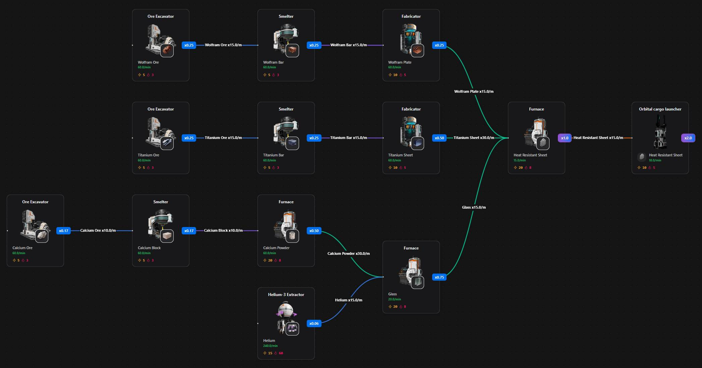
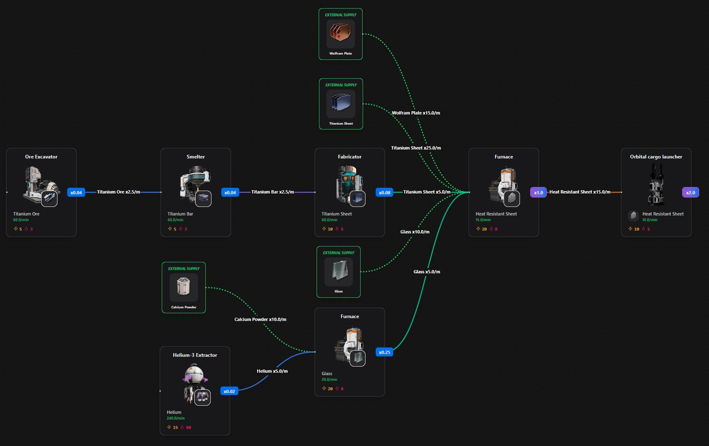

<div align="center">

# StarRupture Planner

**Calculate. Build. Survive.** Optimize your production lines and prepare for the next breach.

</div>

## 🌐 English

| Without external supply                                                                                | With external supply                                                                                                                  |
| ------------------------------------------------------------------------------------------------------ | ------------------------------------------------------------------------------------------------------------------------------------- |
|                           |                                                            |
| Building the entire factory and sourcing all resources internally. No reliance on external facilities. | Importing materials from external sources. This allows for reducing local production capacity or eliminating entire production lines. |

### 🛠️ The Engineer's Toolkit

- **📟 Production Flow**: Set your desired items per minute and let the planner calculate every machine and belt needed.
- **🔋 Supply Management**: Importing resources from another outpost? Mark them as **Supply** to recalculate the local chain and save space.
- **📊 Visual Mapping**: Clear separation between machines and items. See exactly how your materials flow at a glance.
- **🌡️ Critical Systems**: Live tracking of **Power** consumption and **Heat**. Ensure your base stays operational before the next wave hits.

### 🕹️ How to Plan

1. **🎯 Set a Target**: Pick an item and the rate/min you need for your defenses or upgrades.
2. **📥 Filter Supplies**: If you already have materials coming in, toggle **Supply** to shrink the production tree.
3. **📐 Grid Stability**: Check the total Power and Heat metrics to make sure your grid can handle the new load.

---

## 🌐 Español

| Sin suministro externo                                                                                              | Con suministro externo                                                                                                                  |
| ------------------------------------------------------------------------------------------------------------------- | --------------------------------------------------------------------------------------------------------------------------------------- |
|                                        |                                                              |
| Requiere crear toda la infraestructura y obtener todos los recursos de forma interna. No depende de otras fábricas. | Utiliza materiales importados o de proveedores externos. Permite reducir o eliminar líneas de producción locales para ganar eficiencia. |

### 🛠️ Herramientas de Ingeniería

- **📟 Flujo de Producción**: Define cuántos objetos quieres por minuto y el planner calculará cada máquina y cinta necesaria.
- **🔋 Gestión de Suministros**: ¿Traes recursos de otra base? Márcalos como **Supply** para recalcular la cadena y ahorrar espacio.
- **📊 Mapa Visual**: Diferenciación clara entre máquinas y objetos. Mira exactamente cómo fluyen tus materiales de un vistazo.
- **🌡️ Sistemas Críticos**: Monitoriza el consumo de **Energía (Power)** y el **Calor (Heat)**. Asegúrate de que tu base aguante antes de la próxima oleada.

### 🕹️ Cómo planificar

1. **🎯 Elige Objetivo**: Selecciona un objeto y la cantidad/min que necesitas para tus defensas o mejoras.
2. **📥 Filtra Suministros**: Si ya te llegan materiales de fuera, activa el **Supply** para reducir el árbol de producción.
3. **📐 Estabilidad**: Revisa las métricas de Energía y Calor para confirmar que tu red eléctrica soportará la nueva carga.

---

## 🛠️ Tech Stack

[](https://reactjs.org/)
[](https://vitejs.dev/)
[](https://www.typescriptlang.org/)
[](https://tailwindcss.com/)
[](https://zustand-demo.pmnd.rs/)
[](https://reactflow.dev/)

### 📦 Instalación / Installation

Requisitos / Requirements: Node.js 24.20.0 and pnpm 11.19.0.

```bash
# 1. Activar la versión fijada de pnpm / Enable the pinned pnpm version
corepack enable
corepack prepare pnpm@11.19.0 --activate

# 2. Instalar desde el lockfile / Install from the lockfile
pnpm install --frozen-lockfile

# 3. Iniciar / Run
pnpm dev
```

### Validación antes de integrar / Pre-merge validation

Ejecuta la misma definición de listo que usa CI:

```bash
pnpm test:all
```

El comando comprueba formato, lint, tipos E2E, tests unitarios, build y recorridos Chromium en ese orden. Se detiene en el primer fallo y
muestra una tabla con el comando local que debe repetirse. Consulta la [guía E2E](./e2e/README.md) para preparar Chromium y ejecutar
recorridos concretos.

### Arquitectura y elección de pruebas / Architecture and test scope

El código sigue una estructura feature-first: las páginas componen APIs públicas de `src/features/`, `src/shared/data/` adapta los snapshots
protegidos del juego y los stores Zustand conservan únicamente estado editable del usuario. El flujo general es:

`JSON del juego → índices de shared/data → lógica de feature → store/provider → UI de página`

- Usa Vitest para cálculos puros, stores y componentes aislados.
- Usa Playwright solo para recorridos críticos entre pantallas, persistencia visible, responsive o teclado.
- Conserva como revisión manual los detalles visuales que no representan un contrato estable.

Consulta el [mapa de estructura](./README-STRUCTURE.md), la [frontera de datos](./src/shared/data/README.md) y la
[guía E2E](./e2e/README.md) antes de mover responsabilidades entre capas.

### Datos del juego / Game data

Antes de contribuir, consulta la [política de datos del juego](./src/shared/data/README.md) y la
[política de iconos](./public/assets/icons/README.md). Los catálogos JSON son snapshots externos: las inconsistencias se gestionan en el código
y sus reemplazos se realizan únicamente como actualizaciones deliberadas del juego.

<p align="center"> <i>Developed with ❤️ for the <b>StarRupture</b> community.</i> </p>
