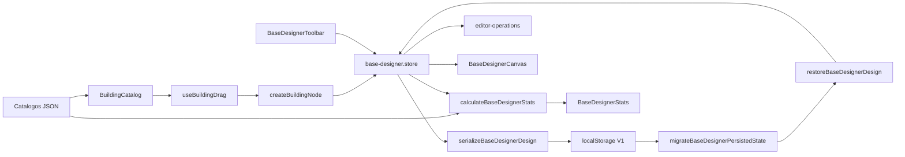

# Base Designer

Editor visual para colocar edificios a escala dentro del area de construccion de la base.
React Flow se usa como capa de interaccion; Zustand contiene el estado editable y los JSON del juego siguen siendo la fuente de verdad.

## Estructura

```text
base-designer/
|- hooks/                 # Orquestacion React: drag y stats derivados
|- lib/                   # Calculos puros, dimensiones, nodos y validacion
|- ui/
|  |- catalog/            # Selector de edificios
|  |- nodes/              # Nodos visuales de React Flow
|  |- toolbar/            # Acciones y confirmacion del editor
|  `- stats/              # Indicadores derivados del diseno
|- base-designer.config.ts
|- types.ts
`- index.ts               # API publica usada por la pagina
```

El estado global vive en `src/store/base-designer.store.ts`, siguiendo la regla del proyecto de centralizar Zustand en `src/store/`.

## Flujo de datos



- `nodes` y `edges` son la unica fuente de verdad editable.
- Los stats nunca se guardan: se calculan desde los IDs colocados y el catalogo.
- Zustand mantiene el estado runtime; `localStorage` conserva un DTO minimo y versionado del diseno actual.
- El campo y los footprints usan `buildings_construction_area.json` y una escala de 10 px por celda.
- El fallback 4x4 solo se usa mientras falten medidas concretas en el catalogo y se identifica como `estimated` en la interfaz.

## Catalogo

`BuildingCatalog` mantiene localmente la vista, la busqueda y la categoria activa; este estado
no forma parte del diseno ni del store Zustand. `filterBuildingCatalog` aplica ambas condiciones
sin reordenar los datos del juego y `getBuildingCatalogCategories` deriva los grupos y contadores
directamente del catalogo recibido.

La busqueda admite nombre, ID y nombre visible de categoria. El contador muestra resultados sobre
el total cuando hay filtros activos y el estado vacio permite limpiarlos sin perder el modo de vista.

## Historial y acciones

El historial vive solo en memoria y conserva hasta 50 operaciones. No forma parte del DTO
persistido. Cada drag completo crea una unica entrada, aunque React Flow emita multiples
cambios de posicion.

- `Ctrl/Cmd + clic`: ampliar o reducir la seleccion.
- `Shift + arrastre`: seleccionar parcialmente los buildings dentro del area.
- `Ctrl/Cmd + A`: seleccionar todos los buildings editables.
- `Escape`: limpiar la seleccion actual.
- `Delete` o `Backspace`: borrar buildings y edges seleccionados.
- `Ctrl/Cmd + Z`: deshacer.
- `Ctrl/Cmd + Shift + Z` o `Ctrl/Cmd + Y`: rehacer.
- `Ctrl/Cmd + D`: duplicar los buildings seleccionados dos celdas en diagonal.
- Limpiar requiere confirmacion y tambien puede deshacerse.

Mover, duplicar o borrar varios buildings genera una sola entrada de historial. El campo y el Base Core
son nodos de sistema: seleccionar todo no los incluye y la accion de borrado nunca los elimina.

## Persistencia

La clave `zstore.base-designer` usa el esquema V1. Solo guarda:

- ID estable de cada instancia y building del catalogo.
- Posicion relativa dentro del campo.
- Receta seleccionada cuando exista.
- Conexiones entre instancias.

Los nodos de sistema, labels, dimensiones, capacidades, estilos y stats no se persisten.
Al recargar, se reconstruyen desde el catalogo actual; buildings eliminados, recetas obsoletas
y conexiones invalidas se descartan de forma segura.

`migrateBaseDesignerPersistedState` contiene la migracion V0 -> V1 y es el unico punto
que debe ampliarse al cambiar el esquema. Las escrituras se agrupan durante 150 ms para
que mover nodos no bloquee el hilo principal.

## Conexiones

`evaluateBaseDesignerConnection` es la unica frontera para decidir si un enlace es valido.
Devuelve los items compatibles o un motivo de rechazo estable para futuras ayudas de UI.

Reglas actuales:

- Solo conecta `item-output` con `item-input` entre buildings.
- Rechaza auto-conexiones, duplicados y ciclos dirigidos.
- El origen debe producir al menos un item requerido por alguna receta del destino.
- Sin receta seleccionada se consideran todas las recetas disponibles del building.
- Con receta seleccionada solo se consideran su output y sus inputs.
- Cada edge guarda `compatibleItemIds`; si solo existe uno tambien guarda `itemId`.
- La rehidratacion vuelve a evaluar las conexiones y descarta las que hayan quedado obsoletas.

Buildings sin recetas no participan aun en conexiones de items. Cuando transportes o almacenes
tengan reglas propias, deben ampliarse aqui y no dentro de los componentes.

## Validacion

```bash
pnpm test
pnpm test:e2e
pnpm lint
pnpm build
```

Las pruebas cubren catalogo, stats, escala y limites, conexiones, store y render de los indicadores.
