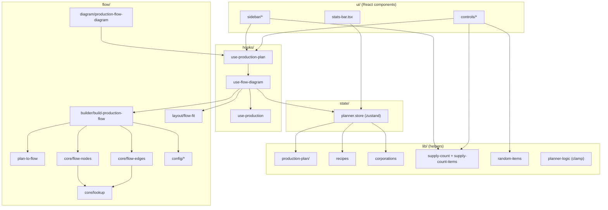
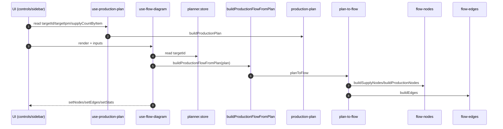

# Planner (Feature)

Esta feature contiene el planner de produccion: UI, flow y logica de soporte.

## Enlaces rapidos

- [Flow (React Flow)](./flow/README.md)
- [Hooks](./hooks/README.md)
- [Lib](./lib/README.md)
- [Production plan](./lib/production-plan/README.md)

## Estructura

```
src/features/planner
+- flow/            # React Flow, layout y helpers del grafo
+- hooks/           # Hooks propios de la feature
+- lib/             # Helpers puros (calculos, filtros, lookups)
+- state/           # (obsoleto) el store real vive en src/store/planner.store.ts
+- ui/              # UI agrupada por dominio
+- constants.ts     # Constantes de la feature
+- index.ts         # Exports publicos
```

## Principios

- UI solo renderiza y despacha acciones.
- La logica del plan vive en `lib/production-plan/`.
- El flow solo convierte un plan a nodos/edges.
- El store mantiene estado y no calcula el plan.

## Guia rapida del flujo

1. `TargetItemSelect` / `TargetRateInput` actualizan el store via `usePlannerTarget`.
2. `useProductionPlan` lee `targetId`, `targetIpm` y `supplyCountByItem` del store.
3. `useProductionPlan` llama a `buildProductionPlan` y devuelve un `plan` unico.
4. Cada diagrama consume el `plan`:
   - `ProductionFlowDiagram` -> `useFlowDiagram` -> `buildProductionFlowFromPlan` -> `planToFlow` -> React Flow.
   - `ProductionTreelistDiagram` -> `buildTree(plan.steps)`.
   - `ProductionItemsDiagram` -> lista `plan.steps`.

## Mini-diagrama (proposito por paso)

```
ProductionFlowDiagram
  -> useFlowDiagram
     (orquesta el render del flow: prepara nodes/edges/stats)
  -> buildProductionFlowFromPlan
     (convierte el plan en datos de flow)
  -> planToFlow
     (transforma pasos en nodos/edges)
  -> React Flow
     (renderiza el grafo y la interaccion)
```

**Resumen rapido**
- `ProductionFlowDiagram`: UI, solo renderiza.
- `useFlowDiagram`: prepara datos visuales a partir del plan.
- `buildProductionFlowFromPlan`: plan -> flow (sin recalcular plan).
- `planToFlow`: crea nodos/edges con la info del plan.
- React Flow: dibuja el grafo.

## Flujo principal (resumen)

```
UI -> useProductionPlan -> buildProductionPlan -> buildProductionFlowFromPlan -> planToFlow -> React Flow
```

## Flujo detallado (top-down)



## Secuencia (alto nivel)



## Mapa de responsabilidad (store vs lib vs flow)

**Store (estado y acciones)**

- `setTargetId`, `setTargetIpm`, `setPlannerStats`
- `setSupplyCount`, `incrementSupplyCount`, `addSupplyItem`, `removeSupplyItem`

**Lib (funciones puras / helpers)**

- `buildProductionPlan`, `clampTargetIpm`
- `findRecipeForItem`
- `isItemExportableToCorporation`
- `getSupplyCountItemIds`, `filterItemsByQuery`, `groupItemsByType`
- `sortRequirementsByTime`, `pickRequirementByIndex`
- `getRandomItemIds`

**Flow (grafo y layout)**

- `buildProductionFlowFromPlan` (plan -> flow)
- `planToFlow`
- `buildEdges`, `connectSupplyAndProduction`
- `buildSupplyNodes`, `buildProductionNodes`, `buildLauncherNode`
- `findItemById`, `getItemName`, `getItemType`, `getBuildingStats`
- `scheduleFlowFitView`, `shouldFitFlowView`

## Notas para devs

- Si necesitas cambiar reglas de calculo, edita `lib/production-plan/`.
- Si el layout se ve raro, revisa `flow/config/dagre-config.ts`.
- Si cambias el nombre de un tipo o campo, ajusta `ProductionStep` y `planToFlow`.


