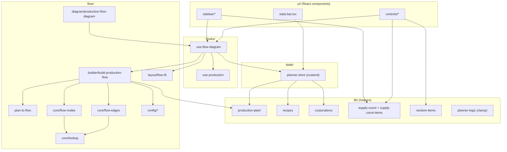
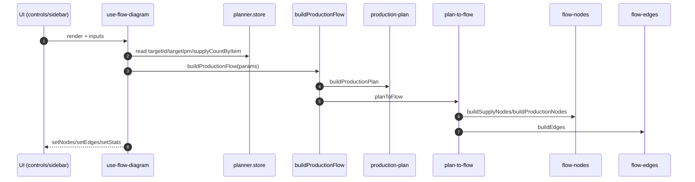

# Planner (Feature)

Esta feature contiene el planner de produccion: UI, flow y logica de soporte.

## Estructura

```
src/features/planner
+- flow/            # React Flow, layout y helpers del grafo
+- hooks/           # Hooks propios de la feature
+- lib/             # Helpers puros (calculos, filtros, lookups)
+- state/           # Zustand store de la feature
+- ui/              # UI agrupada por dominio
+- constants.ts     # Constantes de la feature
+- index.ts         # Exports publicos
```

## Principios

- UI solo renderiza y despacha acciones.
- La logica del plan vive en `lib/production-plan/`.
- El flow solo convierte un plan a nodos/edges.
- El store mantiene estado y no calcula el plan.

## Flujo principal (resumen)

```
UI -> hook -> buildProductionFlow -> buildProductionPlan -> planToFlow -> React Flow
```

## Flujo detallado (top-down)



## Secuencia (alto nivel)



## Mapa de responsabilidad (store vs lib vs flow)

**Store (estado y acciones)**

- `setTargetId`, `setTargetIpm`, `setPlannerStats`
- `setSupplyCount`, `incrementSupplyCount`, `addSupplyItem`, `removeSupplyItem`

**Lib (funciones puras / helpers)**

- `buildProductionPlan`, `clampTargetIpm`
- `findRecipeForItem`
- `isItemExportableToCorporation`
- `getSupplyCountItemIds`, `filterItemsByQuery`, `groupItemsByType`
- `sortRequirementsByTime`, `pickRequirementByIndex`
- `getRandomItemIds`

**Flow (grafo y layout)**

- `buildProductionFlow` (wrapper plan -> flow)
- `planToFlow`
- `buildEdges`, `connectSupplyAndProduction`
- `buildSupplyNodes`, `buildProductionNodes`, `buildLauncherNode`
- `findItemById`, `getItemName`, `getItemType`, `getBuildingStats`
- `scheduleFlowFitView`, `shouldFitFlowView`

## Notas para devs

- Si necesitas cambiar reglas de calculo, edita `lib/production-plan/`.
- Si el layout se ve raro, revisa `flow/config/dagre-config.ts`.
- Si cambias el nombre de un tipo o campo, ajusta `ProductionStep` y `planToFlow`.
