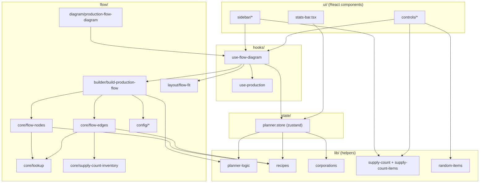
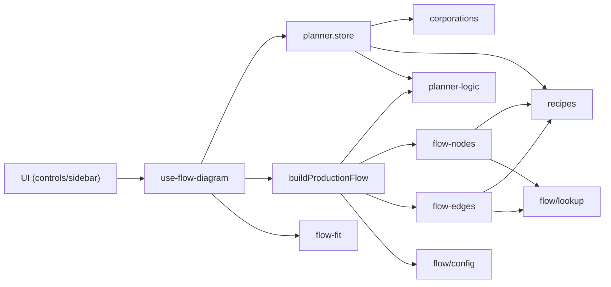
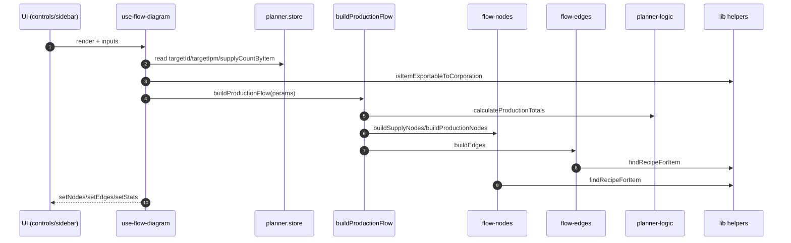
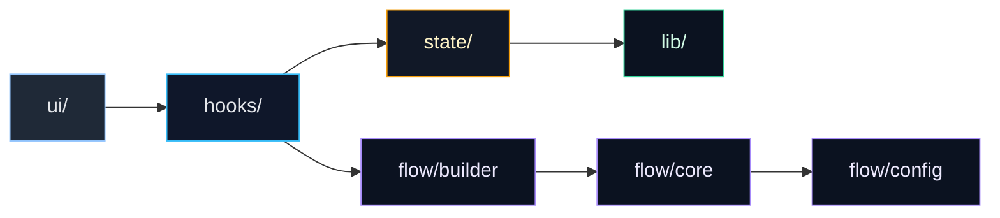

# Planner (Feature)

Esta feature contiene el planner de produccion: UI, flow y logica de soporte.

## Estructura

```
src/features/planner
+- flow/            # React Flow, layout y helpers del grafo
+- hooks/           # Hooks propios de la feature
+- lib/             # Helpers puros (calculos, filtros, lookups)
+- state/           # Zustand store de la feature
+- ui/              # UI agrupada por dominio
+- constants.ts     # Constantes de la feature
+- index.ts         # Exports publicos
```

## Notas

- UI debe enfocarse en render.
- La logica reusable vive en `lib/`.
- Lo especifico del flow vive en `flow/`.
- El store de planner vive en `state/`.

## Esquemas de flujo

### 1) Flujo vertical (top-down)



### 2) Flujo intermedio (flowchart con llamadas)



### 3) Flujo intermedio (sequenceDiagram)



### 5) Flujo con colores por capa



## Mapa de responsabilidad (store vs lib)

**Store (estado y reglas de negocio)**

- `setTargetId`, `setTargetIpm`, `setPlannerStats`
- `setSupplyCount`, `incrementSupplyCount`, `addSupplyItem`, `removeSupplyItem`

**Lib (funciones puras / helpers)**

- `calculateProductionTotals`, `clampTargetIpm`, `toFlowStats`
- `findRecipeForItem`
- `isItemExportableToCorporation`
- `filterItemsByQuery`, `groupItemsByType`, `getSupplyCountItemIds`
- `sortRequirementsByTime`, `pickRequirementByIndex`
- `getRandomItemIds`

**Flow (grafo y layout)**

- `buildProductionFlow` (builder principal)
- `buildEdges`, `connectSupplyAndProduction`
- `buildSupplyNodes`, `buildProductionNodes`, `buildLauncherNode`
- `buildSupplyCountInventory`
- `findItemById`, `getItemName`, `getItemType`, `getBuildingStats`
- `scheduleFlowFitView`, `shouldFitFlowView`
