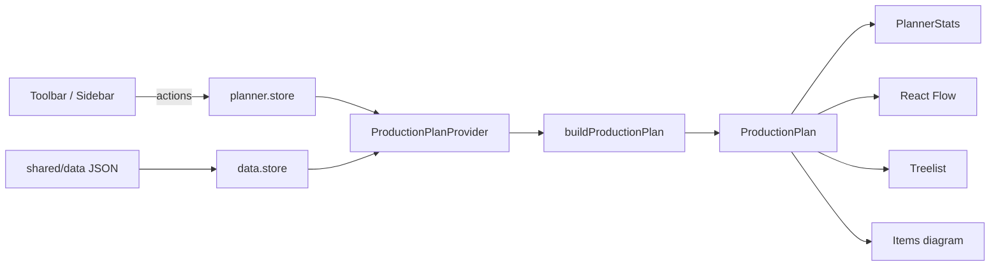
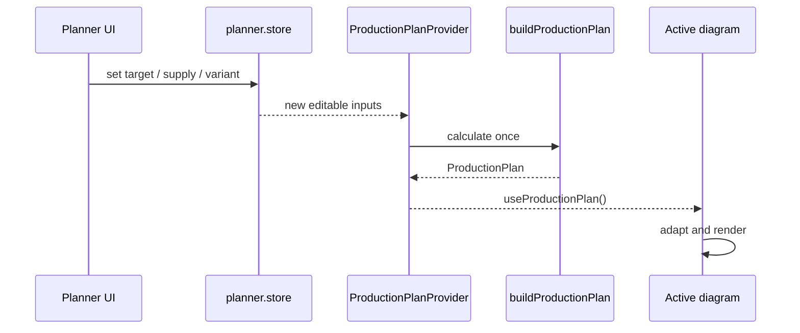

# Planner (Feature)

Planner calcula una linea de produccion, aplica supply y variantes de edificios, y presenta el mismo resultado en varios diagramas.

## Enlaces

- [Flow](./flow/README.md)
- [Hooks](./hooks/README.md)
- [Lib](./lib/README.md)
- [Production plan](./lib/production-plan/README.md)
- [Treelist](./ui/treelist-diagram/README.md)

## Estructura

```text
src/features/planner/
|- flow/          # Adaptacion del plan a React Flow
|- hooks/         # Acceso a target, plan compartido y diagramas
|- lib/           # Reglas puras del dominio
|- providers/     # Calculo unico y distribucion del ProductionPlan
|- types/         # Contratos exclusivos de Planner
|- ui/
|  |- toolbar/    # Target, stats y requisitos de corporation
|  |- sidebar/    # Supply y variantes de edificios
|  |- items-diagram/
|  `- treelist-diagram/
|- constants.ts
`- index.ts       # API publica de la feature
```

## Fuentes de verdad

- `src/shared/data/*.json`: catalogo inmutable del juego.
- `data.store.ts`: acceso reactivo de solo lectura al catalogo.
- `planner.store.ts`: unicamente entradas editables del usuario.
- `ProductionPlanProvider`: unico propietario del plan calculado.
- `ProductionPlan`: resultado derivado; nunca se persiste ni se duplica en Zustand.

## Recorrido principal

1. `PlannerToolbar` y `PlannerSidebar` actualizan target, IPM, supply o variantes en `planner.store.ts`.
2. `ProductionPlanProvider` lee esas entradas y el catalogo.
3. `buildProductionPlan` calcula una sola vez totals, steps y stats.
4. `useProductionPlan` entrega el mismo objeto a toolbar, sidebar y diagramas.
5. Cada diagrama transforma solo la representacion que necesita.


```mermaid
flowchart LR
  UI[Toolbar / Sidebar] -->|actions| Store[planner.store]
  Data[shared/data JSON] --> DataStore[data.store]
  Store --> Provider[ProductionPlanProvider]
  DataStore --> Provider
  Provider --> Builder[buildProductionPlan]
  Builder --> Plan[ProductionPlan]
  Plan --> Stats[PlannerStats]
  Plan --> Flow[React Flow]
  Plan --> Tree[Treelist]
  Plan --> Items[Items diagram]
```

## Secuencia


```mermaid
sequenceDiagram
  participant UI as Planner UI
  participant Store as planner.store
  participant Provider as ProductionPlanProvider
  participant Builder as buildProductionPlan
  participant View as Active diagram

  UI->>Store: set target / supply / variant
  Store-->>Provider: new editable inputs
  Provider->>Builder: calculate once
  Builder-->>Provider: ProductionPlan
  Provider-->>View: useProductionPlan()
  View->>View: adapt and render
```

## Responsabilidades

- **Store:** target, target IPM, supply, variantes y acciones concretas.
- **Provider:** ciclo de vida y reutilizacion del plan derivado.
- **Lib:** calculos puros, recetas, corporations y requisitos.
- **Flow:** nodos, edges, layout y ajuste de viewport.
- **UI:** render e interaccion; no recalcula reglas de produccion.

## Cambios habituales

- Regla de calculo: `lib/production-plan/`.
- Variante o receta: `lib/building-variants.ts` y `lib/recipes.ts`.
- Nodos o edges: `flow/core/` y `flow/plan-to-flow.ts`.
- Layout del grafo: `flow/config/dagre-config.ts`.
- Supply UI: `ui/sidebar/supply-panel/`.
